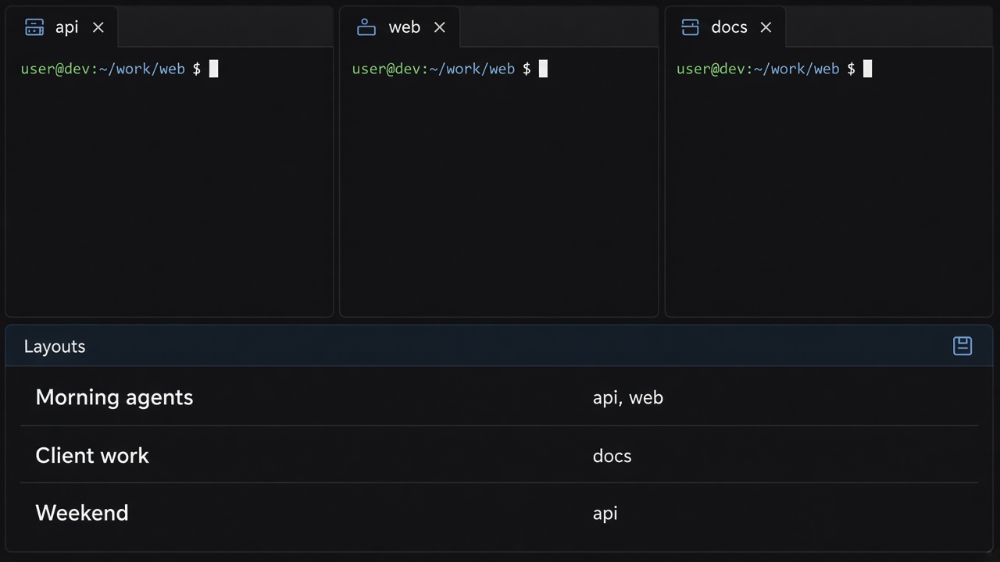

# Terminal Keeper

For when your agents each have a terminal and you are tired of opening them again.

You leave a tab in the scheduler, a split on the client repo, another one wherever the last agent was working. Close Cursor, or lose the WSL connection, and that setup is gone. Terminal Keeper keeps the tabs and the folders, and lets you bookmark a whole set the way you would bookmark tabs in Chrome.



## Save what you have open

The **Layouts** pane sits in the bottom panel, next to Terminal.

- **Save all tabs** stores the tabs and folders open right now, under a name you choose.
- Click a name to open that set again. Tabs you already have stay open.
- The trash icon deletes a saved layout.

Auto-save of the live setup is **off by default**. Turn it on from **Terminal Keeper: Options** (or the Options tab in the Layouts pane) if you want every tab change written to `.cursor/terminal-layout.json`. Named layouts via **Save all tabs** still work either way.

**Ctrl+Shift+5** splits the current tab and keeps the new pane in the same folder.

## Options

Command Palette → **Terminal Keeper: Options**, or the **Options** tab next to Saved layouts.

- **Restore saved terminals on reload** → `terminalKeeper.autoRestore` in `settings.json`
- **Auto-save open tabs** → `terminalKeeper.autoSave` (default off)
- Max panes, restore delay, tmux prefix

The panel **+** button is still a normal shell. It is not saved.

## Install

You need `tmux`. Then, from this folder:

```bash
bash install.sh
```

Reload the window. The first time, use **Terminal Keeper: New Persistent Terminal** so a tab is one Terminal Keeper knows about.

Layouts are stored in `<workspace>/.cursor/terminal-bookmarks.json`. The live tabs are in `<workspace>/.cursor/terminal-layout.json`.

If tmux is still running after Cursor dies, the next open reattaches those same panes. If WSL itself shuts down, the folders come back and the processes that were running do not.
